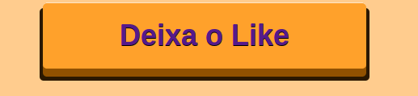

## Porque estilizar o botão
Os botões são elementos fundamentais na interface de qualquer aplicação, pois eles permitem que os usuários realizem ações e interajam com a interface. Por isso, é importante que os botões sejam atraentes e fáceis de usar, para garantir uma boa experiência do usuário.

Um botão atraente deve ser chamativo e fácil de encontrar, mas ao mesmo tempo deve ser discreto e não distrair o usuário da tarefa que ele está realizando. Além disso, os botões devem ter um tamanho e posicionamento adequados, para que sejam fáceis de clicar.

## gif



## html
```html
<div ontouchstart="">
  <div class="button">
    <a href="#">Mobile First</a>
  </div>
</div>

```
## css
```css
body{
  text-align:center;
  background-color:#ffcc8e;
}

.button{
  position:relative;
  display:inline-block;
  margin:20px;
}

.button a{
  color:white;
  font-family:Helvetica, sans-serif;
  font-weight:bold;
  font-size:36px;
  text-align: center;
  text-decoration:none;
  background-color:#FFA12B;
  display:block;
  position:relative;
  padding:20px 40px;

  -webkit-tap-highlight-color: rgba(0, 0, 0, 0);
  text-shadow: 0px 1px 0px #000;
  filter: dropshadow(color=#000, offx=0px, offy=1px);

  -webkit-box-shadow:inset 0 1px 0 #FFE5C4, 0 10px 0 #915100;
  -moz-box-shadow:inset 0 1px 0 #FFE5C4, 0 10px 0 #915100;
  box-shadow:inset 0 1px 0 #FFE5C4, 0 10px 0 #915100;

  -webkit-border-radius: 5px;
  -moz-border-radius: 5px;
  border-radius: 5px;
}

.button a:active{
  top:10px;
  background-color:#F78900;

  -webkit-box-shadow:inset 0 1px 0 #FFE5C4, inset 0 -3px 0 #915100;
  -moz-box-shadow:inset 0 1px 0 #FFE5C4, inset 0 -3pxpx 0 #915100;
  box-shadow:inset 0 1px 0 #FFE5C4, inset 0 -3px 0 #915100;
}

.button:after{
  content:"";
  height:100%;
  width:100%;
  padding:4px;
  position: absolute;
  bottom:-15px;
  left:-4px;
  z-index:-1;
  background-color:#2B1800;
  -webkit-border-radius: 5px;
  -moz-border-radius: 5px;
  border-radius: 5px;
}

```
## explicação
O código acima mostra um exemplo de como criar um botão atraente usando HTML e CSS. O botão é criado dentro de uma div com a classe "button", e contém um link com o texto "Mobile First". O CSS é usado para estilizar o botão, definindo sua cor, fonte, tamanho e sombra.

A classe "button" é usada para posicionar o botão no centro da página e dar margem em volta dele. A classe "button a" é usada para estilizar o link dentro do botão, definindo sua cor, fonte, tamanho e sombra. A classe "button a:active" é usada para estilizar o botão quando ele é clicado, mudando sua cor e sombra. A classe "button:after" é usada para adicionar uma sombra embaixo do botão.

O atributo ontouchstart é adicionado a div pai, para garantir que o botão tenha um feedback tátil no dispositivos mobile. Além disso, algumas propriedades, como -webkit-tap-highlight-color, são adicionadas para remover o efeito padrão de highlight quando o botão é tocado.

Em resumo, os botões são elementos fundamentais na interface de qualquer aplicação, e é importante que eles sejam atraentes e fáceis de usar para garantir uma boa experiência do usuário. O código acima mostra um exemplo de como criar um botão atraente usando HTML e CSS, destacando as principais propriedades e técnicas utilizadas para criar botões mobile friendly.


