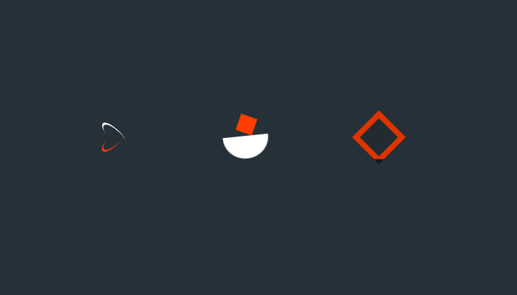

# loaders


Loaders são elementos visuais que indicam que uma ação está sendo realizada, geralmente enquanto uma página está carregando ou uma ação é executada no back-end. Eles são importantes porque dão ao usuário uma indicação de que algo está acontecendo e evitam que o usuário pense que a página está travada ou que a ação não foi executada.

No código acima, três loaders diferentes são criados usando HTML e CSS. O primeiro loader é criado usando uma caixa com uma borda arredondada e dois elementos "before" e "after" que são animados para girar. O segundo loader é criado usando um elemento "after" que é animado para se mover para cima e para baixo, e um elemento "before" que é animado para girar. O terceiro loader é criado usando um elemento "after" que é animado para se mover para cima e para baixo e um elemento "before" que é animado para girar.


## html
```html
<!DOCTYPE html>
<html lang="pt-BR">

<head>
  <title>3 loaders</title>
  <meta charset="UTF-8">
  <meta name="viewport" content="width=device-width, initial-scale=1">
  <link href="style.css" rel="stylesheet">
</head>

<body>
  <div class="Container">
    <div class="loader-1"></div>
    <div class="loader-2"></div>
    <div class="loader-3"></div>
  </div>

</body>

</html>


```
## css


```css
html,body {
  margin: 0;
  padding: 0;
  box-sizing: border-box;
  background: #263038;
}

.Container {
  display: flex;
  align-items: center;
  justify-content: center;
  gap: 8rem;
  width: 100vw;
  height: 100vh;
}

.loader-1 {
  transform: rotateZ(45deg);
  perspective: 1000px;
  border-radius: 50%;
  width: 48px;
  height: 48px;
  color: #fff; 
}

.loader-1:before, .loader-1:after {
  content: '';
  display: block;
  position: absolute;
  top: 0;
  left: 0;
  width: inherit;
  height: inherit;
  border-radius: 50%;
  transform: rotateX(70deg);
  animation: 1s spin linear infinite;
}
.loader-1:after {
  color: #FF3D00;
  transform: rotateY(70deg);
  animation-delay: .4s;
}

@keyframes rotate {
  0% {
    transform: translate(-50%, -50%) rotateZ(0deg);
  }
  100% {
    transform: translate(-50%, -50%) rotateZ(360deg);
  }
}

  @keyframes rotateccw {
    0% {
      transform: translate(-50%, -50%) rotate(0deg);
    }
    100% {
      transform: translate(-50%, -50%) rotate(-360deg);
    }
}

@keyframes spin {
  0%,
    100% {
    box-shadow: .2em 0px 0 0px currentcolor;
  }
  12% {
    box-shadow: .2em .2em 0 0 currentcolor;
  }
    25% {
      box-shadow: 0 .2em 0 0px currentcolor;
    }
    37% {
      box-shadow: -.2em .2em 0 0 currentcolor;
    }
    50% {
      box-shadow: -.2em 0 0 0 currentcolor;
    }
    62% {
      box-shadow: -.2em -.2em 0 0 currentcolor;
    }
    75% {
      box-shadow: 0px -.2em 0 0 currentcolor;
    }
    87% {
      box-shadow: .2em -.2em 0 0 currentcolor;
    }
}


.loader-2 {
  position: relative;
  width: 64px;
  height: 60px;
}

.loader-2::after {
  content: '';
  position: absolute;
  left: 0;
  bottom: 0;
  background: #fff;
  width: 64px;
  height: 32px;
  border-radius: 0 0 50px 50px;
  animation: move 0.5s linear infinite alternate;
}

.loader-2::before {
  content: '';
  position: absolute;
  left: 50%;
  top: 0;
  background: #FF3D00;
  width: 24px;
  height: 24px;
  transform: translateX(-50%) rotate(0deg);
  animation: rotate 2s linear infinite;
}

@keyframes rotate {
  100% { transform: translateX(-50%) rotate(360deg)}
}

@keyframes move {
  0% { transform: rotate(10deg)}
  100% { transform: rotate(-10deg)}
}


.loader-3 {
  position: relative;
  width: 54px;
  height: 54px;
  background-color: rgba(0, 0, 0, 0.5);
  transform: rotate(45deg);
  overflow: hidden;
}
.loader-3:after{
  content: '';
  position: absolute;
  inset: 8px;
  margin: auto;
  background: #222b32;
}
.loader-3:before{
  content: '';
  position: absolute;
  inset: -15px;
  margin: auto;
  background: #de3500;
  animation: diamondLoader 2s linear infinite;
}
@keyframes diamondLoader {
  0%  ,10% {
    transform: translate(-64px , -64px) rotate(-45deg)
  }
  90% , 100% {
    transform: translate(0px , 0px) rotate(-45deg)
  }
}


```


